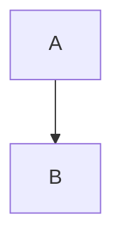
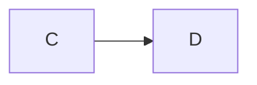
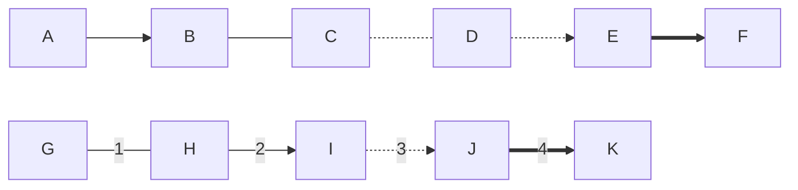
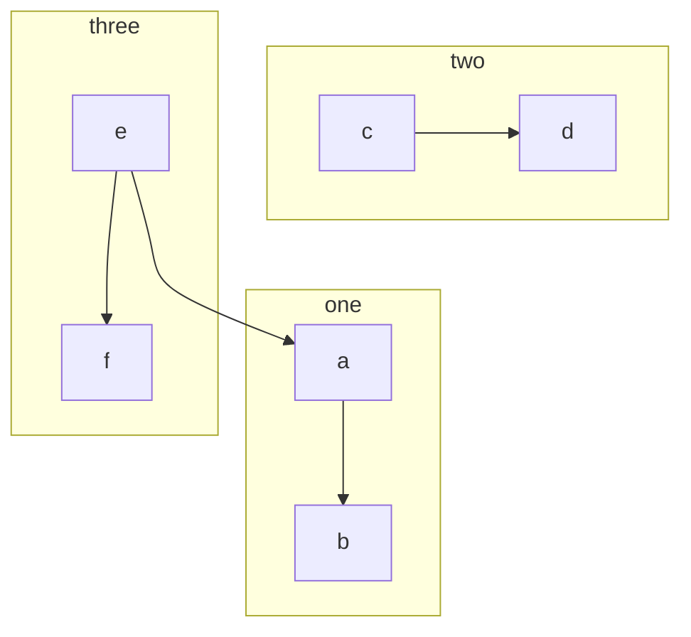
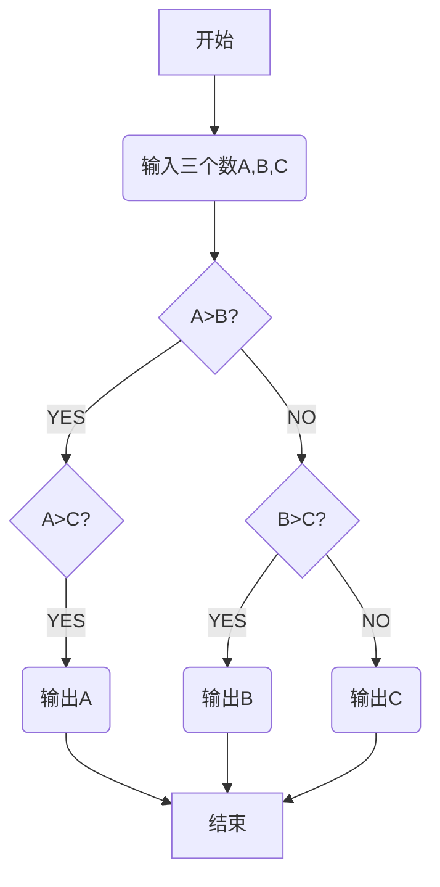

# markdown编辑器学习与语法总结

## 一、标题
# First title(#)
## second (##)
### third (###)
#### fourth(####)
##### fifth title(#####)

---

## 二、字体
**加粗**(** ?**)
*倾斜*(* ? *)
***加粗倾斜*** ( *** ？ ***)
~~删除线~~(~~   ？ ~~)

---

## 三、引用
> C makes it easy to shoot yourself inthe foot; C++ makes it harder, butwhen you do, it blows away your whole leg.  ——Bjarne Stroustrup
---

## 四、 分割线（3+ - or *）

---
***
## 五、图片

___

***
## 六、超链接

___
eg.[CSDN](http://www.csdn.net) [百度](http://www.baidu.com) [GitHub](http://www.github.com)
## 七、列表
### 1.无序列表（- 接空格）
- txet1
- txet2
### 2.无序列表（数字后跟点接空格）
1. text1
2. text2
### 3.列表嵌套（上一级与下一级接三个空格）
- text1
   - text2
   1. text1
   
   2. text2
   
      ---
## 八、表格
| 表头1 | 表头2 |
| ----- | ----- |
| 项目1 | 项目2 |
| 项目3 | 项目4 |

| Column1| Column2|Column3|
|:--------:| -------------:|:--------------------------------|
|文本居中| 文本居右 |文本居左|


---

## 九、代码

```c++
#include<iostream>
using namespace std;
int main()
{
	cout<<"Hello,World!"<<endl;
	return 0;
}
```

---

## 十、流程图

### 流程图方向有下面几个值

TB 从上到下
BT 从下到上
RL 从右到左
LR 从左到右
TD 同TB

eg.从上到下

eg.从左到右

### 基本图形
- id + [文字描述]矩形
- id + (文字描述)圆角矩形
- id + >文字描述]不对称的矩形
- id + {文字描述}菱形
- id + ((文字描述))圆形

### 节点之间的连接
- A --> B A带箭头指向B
- A --- B A不带箭头指向B
- A -.- B A用虚线指向B
- A -.-> B A用带箭头的虚线指向B
- A ==> B A用加粗的箭头指向B
#### 带有描述的注意字符的左二右三原则
- A -- 描述 --- B A不带箭头指向B并在中间加上文字描述
- A -- 描述 --> B A带箭头指向B并在中间加上文字描述
- A -. 描述 .-> B A用带箭头的虚线指向B并在中间加上文字描述
- A == 描述 ==> B A用加粗的箭头指向B并在中间加上文字描述

### 子流程图

### 实战:绘制一个流程图,找出 A、 B、 C 三个数中最大的一个数。


## 参考博客：

## 1. [如何在Markdown中画流程图](https://www.jianshu.com/p/b421cc723da5)

2. [Markdown基本语法](https://www.jianshu.com/p/191d1e21f7ed)


